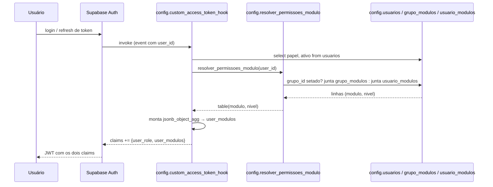
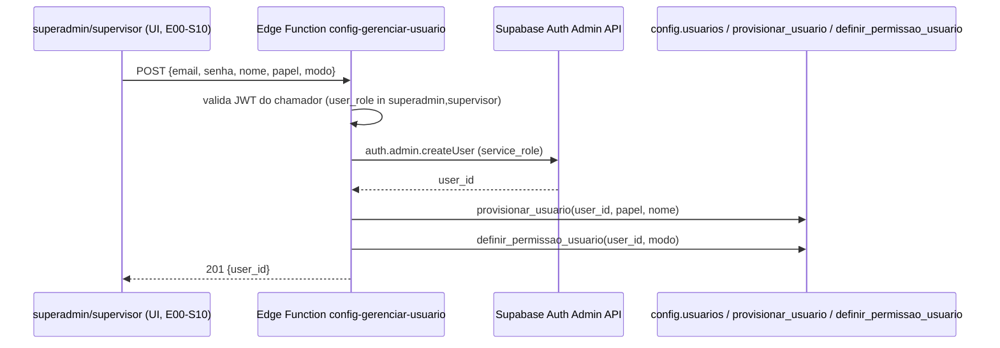

# Technical Design Doc — Grupos e Permissões por Módulo: Fundação

> **Tier:** arquitetural · **Status:** aprovado
> **Autor:** Claude (sessão Lucas) · **Revisores:** Lucas · **Data:** 2026-07-02
> Estende `ADR-0003` (não edita) via novo `ADR-0004`. Link: `./product.md`, `./domain.md`.

## Contexto da funcionalidade
RBAC atual é fixo por papel (`ADR-0003`, migrations `0002`/`0004`/`0005`). Esta feature adiciona
uma segunda dimensão de autorização — permissão por módulo, configurável em runtime pelo
`superadmin`/`supervisor` — sem abandonar o mecanismo JWT-embedded/O(1) que o `ADR-0003` já
estabeleceu.

## Goals / Non-goals
**Goals**
- `superadmin`/`supervisor` criam grupos com permissão (`leitura`/`escrita`) por módulo.
- Usuário tem, mutuamente exclusivo: grupo (herda) OU permissão individual por módulo.
- RLS de domínio decide por módulo+nível, não mais por papel bruto (exceto `superadmin`,
  sempre irrestrito, e `cliente-sindico`, inalterado).
- Criação de usuário via Edge Function (Auth Admin API), substituindo o runbook SQL-only.

**Non-goals**
- UI (telas) — `E00-S10`.
- Granularidade menor que módulo inteiro.
- Reflexo instantâneo de mudança de permissão (mesmo trade-off do `ADR-0003`).

## Design proposto

### Fluxo de resolução de permissão (login/refresh de token)

### Fluxo de criação de usuário (Edge Function)

## Cobertura dos 5 eixos

### 1. Tech stack
Sem lib nova. Edge Function usa `fetch` nativo (padrão já usado no cliente Auvo desenhado em
`E01-S09`) + `@supabase/supabase-js` (já dependência do projeto) com a `service_role` key
(injetada automaticamente pelo runtime da Edge Function, sem `secrets set` novo).

### 2. Arquitetura base
Estende o bounded context `config` (governança), não cria um novo. Frontend ganha
`features/config/` (hexagonal, espelha `features/auth/`) — mas essa parte é `E00-S10`; esta
story só prepara o Edge Function que a UI vai chamar.

### 3. Infra
Nenhum recurso novo além das tabelas/função/Edge Function. Reversão segura: `NullAuvoGateway`-
style não se aplica aqui (é RLS de banco, não um adapter opcional) — reversão é uma migration
nova revertendo as `alter policy` (documentado no `-- Reverso:` de cada migration).

### 4. Qualidade
- pgTAP (`supabase/tests/`): cobre os 2 modos de resolução, exclusividade mútua (trigger recusa),
  RLS de domínio por módulo×nível×papel, `feature_flags` superadmin-only, usuário inativo sem
  permissão, `supervisor` não promove a `superadmin`.
- Contrato: request/response da Edge Function testado manualmente (sem test runner de Edge
  Function no projeto ainda — mesma lacuna já observada no design de `E01-S09`).
- Performance: resolução de permissão é O(1) por request (embutida no JWT) — sem impacto de
  latência na leitura de tabelas de domínio, igual ao `ADR-0003`.

### 5. Observabilidade
Nenhum log estruturado novo necessário nesta fase — a Edge Function de criação de usuário é de
baixo volume (ação administrativa pontual), sem SLA de UI. Se o volume crescer, revisitar.

## Mapa de dependências
| Dependência | Tipo | Descrição | Métodos / endpoints |
|---|---|---|---|
| Supabase Auth Admin API | REST (`service_role`) | Criação de usuário | `POST /auth/v1/admin/users` (via `supabase-js` `auth.admin.createUser`) |
| `config.provisionar_usuario` | SQL function (já existe) | Vincula papel ao usuário recém-criado | chamada pela Edge Function via client `service_role` |

## Alternativas consideradas
| Alternativa | Prós | Contras | Por que (não) escolhida |
|---|---|---|---|
| Claim JWT estruturado `user_modulos` (escolhida) | Mesmo custo O(1) do ADR-0003, granularidade real | Hook mais complexo (2 fontes possíveis) | **Escolhida** — não quebra o princípio já estabelecido |
| Subquery a `grupo_modulos`/`usuario_modulos` em cada policy | Sempre atualizado | Reintroduz exatamente o custo/risco que o ADR-0003 rejeitou | Rejeitada |
| CHECK constraint para exclusividade grupo×individual | Declarativo | CHECK não cruza tabelas — inviável tecnicamente | Rejeitada |

## Trade-offs e consequências
- Aceitamos a mesma staleness de ~1h do `ADR-0003` para mudança de permissão — evita reabrir essa
  decisão e mantém o custo por request em zero.
- `supervisor` ganha uma capacidade especial (gestão de usuário/grupo) fora do sistema de
  módulos — é uma exceção deliberada, documentada, não um padrão a repetir sem necessidade.

## Riscos
| Risco | Descrição | Prob. × Impacto | Ações / mitigações |
|---|---|---|---|
| Bug na reescrita do hook | Quebra autorização de todo mundo no próximo refresh | baixa × alto | pgTAP cobrindo os 2 modos + superadmin + inativo antes do merge; testar em `supabase db reset` local |
| `service_role` sem `execute` em `provisionar_usuario` | Edge Function falha ao criar usuário | média × médio | Verificar em `supabase db reset` local; se faltar, `grant execute ... to service_role` numa migration |
| Escalação de privilégio via `supervisor` | Supervisor comum promove alguém a `superadmin` | baixa × alto | `with check` da policy de UPDATE de `config.usuarios` bloqueia isso explicitamente (ver `spec.md` AC) |

## Roadmap da feature
| Fase | Entrega | Depende de |
|---|---|---|
| 1 (`E00-S09`, este story) | Schema, resolver, hook, Edge Function de usuário | `E00-S08` mergeada |
| 2 (`E00-S10`) | UI administrativa (grupos, usuários) + gating de sidebar | Fase 1 mergeada |

## Questões em aberto
- [ ] Confirmar em `supabase db reset` local se `service_role` já tem `execute` em
      `provisionar_usuario` (revogado de `public, anon, authenticated`, não explicitamente de
      `service_role`) — task-time, não bloqueia o design.
- [ ] Confirmar se Squawk realmente acusa a FK `usuarios.grupo_id` sem `NOT VALID` — task-time.

> Decisão difícil de reverter tomada aqui (claim JWT estruturado, exclusividade via trigger) →
> registrada em `docs/adr/0004-permissoes-por-modulo-grupos.md`.
