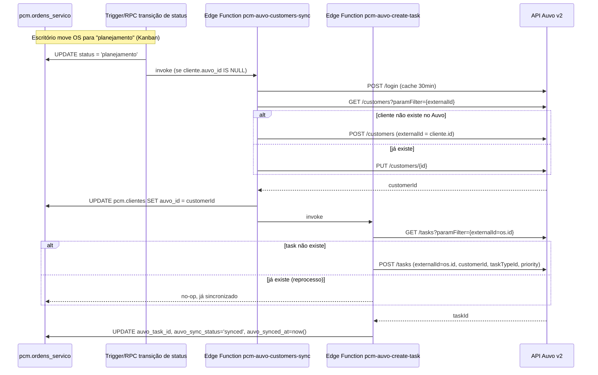

# Technical Design Doc — Integração Auvo: Fundação

> **Tier:** arquitetural · **Status:** rascunho
> **Autor:** Claude (estudo, sessão Lucas) · **Revisores:** Fabrício (Sinérgica) · **Data:** 2026-07-02
> Responde: **como** no nível de sistema. Cobre a fundação reutilizada por `E01-S10` (webhook de
> status) e `E01-S11` (sync de técnicos/equipamentos).

## Contexto da funcionalidade
`docs/adr/0001-pcm-origin-truth-externalid.md` já decidiu **o quê**: PCM decide, Auvo executa,
idempotência via `externalId`. `docs/blueprint/integracoes/auvo.md` já esboça 6 Edge Functions e
o mapeamento de status. Este design formaliza **como** construir as duas primeiras (sync de
clientes, criação de task) mais o cliente HTTP compartilhado, usando o mapeamento real de
endpoints (`Auvo-API-Mapeamento-Completo.md`, vault). Link: `./product.md`, `./domain.md`.

## Goals / Non-goals
**Goals**
- Cliente HTTP Auvo único, testável, reutilizado por toda Edge Function de integração (auth
  cacheada, retry de 401, respeito ao rate limit de 400 req/min).
- Sync de cliente PCM → Auvo idempotente por `externalId`.
- Criação de task Auvo idempotente por `externalId` quando OS entra em `planejamento`.
- Falha do Auvo nunca bloqueia a transição de status da OS no PCM (é o *system of record*).

**Non-goals**
- Processar webhooks do Auvo (`E01-S10`).
- Sync de técnicos/equipes/equipamentos (`E01-S11`).
- Fila com reprocessamento automático agendado — este story usa retry síncrono simples (3
  tentativas) e marca `failed` para reconciliação manual; fila/cron fica como fase 2 (ver
  Roadmap da feature).

## Design proposto

### Visão geral do fluxo (fase 1 — este story)

### Componentes
1. **`packages/database` ou `apps/web/supabase/functions/_shared/auvo/client.ts`** — cliente HTTP
   Auvo compartilhado (Deno, roda em Edge Function): `auvoToken()` (cache em memória do processo,
   expira 120s antes do `expiration` real — ver exemplo TS do mapeamento, seção 12), `auvoGet`,
   `auvoPost`, `auvoPut`, todos com retry automático de 401 (token expirado) 1x, e backoff simples
   em 429 (rate limit).
2. **`supabase/functions/pcm-auvo-customers-sync/`** — Edge Function. Recebe `{ clienteId }`,
   busca `pcm.clientes`, verifica `auvo_id`; se nulo, busca por `externalId` no Auvo (evita
   duplicar se já foi criado manualmente antes desta integração existir) e cria ou vincula;
   grava `auvo_id` de volta.
3. **`supabase/functions/pcm-auvo-create-task/`** — Edge Function. Recebe `{ osId }`, resolve
   `taskTypeId` a partir de `categoria` da OS (tabela de mapeamento, ver Cobertura dos 5 eixos →
   Arquitetura base), garante que `cliente.auvo_id` existe (chama sync de cliente se não —
   fallback síncrono, não é a via principal), cria a task com `externalId = osId`, grava
   `auvo_task_id`/`auvo_sync_status`/`auvo_synced_at` (ou `failed`/`auvo_sync_error`).
4. **Trigger de transição de status** — `pcm.ordens_servico` já tem (ou ganha, se não tiver) uma
   forma de disparar Edge Function no `UPDATE ... SET status = 'planejamento'`. Padrão do
   projeto: `pg_net` (`supabase/functions/_template/index.ts` + `_shared/`) para chamar a Edge
   Function via HTTP a partir de um trigger Postgres, **não** trigger síncrono bloqueante (a
   chamada ao Auvo não pode travar o `UPDATE` da OS).

### Contrato dos dados trocados
| Campo PCM | Campo Auvo (`POST /customers`) | Campo Auvo (`POST /tasks`) |
|-----------|-------------------------------|------------------------------|
| `clientes.id` | `externalId` | — |
| `clientes.razao_social`/`nome` | `description` | — |
| `clientes.endereco` | `address` (+ geocoding automático do Auvo, ver mapeamento §10) | — |
| `ordens_servico.id` | — | `externalId` |
| `clientes.auvo_id` | — | `customerId` |
| `ordens_servico.categoria` | — | `taskTypeId` (tabela de mapeamento) |
| `ordens_servico.prioridade` | — | `priority` (1/2/3 — GUT mapeado para 3 níveis, ver Casos de borda) |
| `ordens_servico.descricao` | — | `orientation`/`description` |

## Cobertura dos 5 eixos

### 1. Tech stack
Nenhuma lib nova além do runtime Deno padrão de Edge Function (`fetch` nativo, sem SDK do Auvo —
não existe SDK oficial JS, confirmado no mapeamento). Sem dependência de terceiros.

### 2. Arquitetura base
Segue `interfaces → application → domain ← infrastructure` já em vigor:
- `domain`: nenhuma mudança de tipo, só o VO `AuvoSyncStatus` (ver `domain.md`) formalizado
  onde a OS já expõe seu status de sync.
- `application`: novo port `AuvoGatewayPort` (`syncCustomer`, `createTask`) — caso de uso
  "TransicionarOSParaPlanejamento" passa a chamar o port em vez de só persistir o status.
- `infrastructure`: adapter `SupabaseAuvoGateway` implementa o port chamando as Edge Functions
  (via `fetch` interno ou `supabase.functions.invoke`) — a Edge Function em si mora em
  `supabase/functions/`, fora da árvore `apps/web/src/features/`, por ser runtime Deno separado.
- Tabela `taskTypeId` por categoria vira uma constante versionada em código
  (`supabase/functions/_shared/auvo/task-type-map.ts`), não uma tabela de banco — muda raramente
  e o SPEC_DEVIATION de mudar isso é barato (um PR).

### 3. Infra
- Secrets novos no Supabase Vault (não no `.env` do client — `service_role`/Auvo nunca no
  browser): `AUVO_API_KEY`, `AUVO_USER_TOKEN` (já em `.env.local` local para dev e como GitHub
  Actions secrets em produção — sincronizados para o Supabase via
  `.github/workflows/sync-secrets.yml` a cada deploy, não mais via `supabase secrets set` manual).
- Sem infra nova (fila, cache) nesta fase — token cacheado em memória do processo Edge Function
  já é suficiente dado o volume baixo.
- Reversão: `AuvoGatewayPort` tem uma implementação `NullAuvoGateway` (no-op, sempre
  `auvo_sync_status = pending`) usável via feature flag (`config/env.ts`, padrão já existente no
  projeto) para desligar a integração em produção sem reverter deploy, se necessário.

### 4. Qualidade
- Unidade: mapeamento `categoria → taskTypeId`, transições válidas do VO `AuvoSyncStatus`.
- Integração: `SupabaseAuvoGateway` contra um mock HTTP do Auvo (mesma técnica que
  `db/rls-test.md` usa para pgTAP — aqui é `msw`/fetch mock, já padrão no projeto? **verificar em
  tasks.md**, se não houver, introduzir).
- Contrato: teste que garante que o corpo enviado a `POST /tasks` bate com o schema documentado
  no mapeamento (campo a campo da tabela acima).
- Aceite: um teste por AC desta spec — ver `spec.md`.
- Performance: chamada ao Auvo é assíncrona (trigger `pg_net`, não bloqueia o `UPDATE` da OS) —
  sem budget de p95 na transação de banco; a Edge Function em si não tem SLA de UI (é
  background).

### 5. Observabilidade
- Log estruturado (`apps/web/src/lib/log.ts` como padrão de formato, adaptado para Deno) em toda
  chamada Auvo: `X-Request-Id` da resposta (guia SLA do Auvo, seção 8 do mapeamento) + timestamp
  UTC — é o dado que o suporte Auvo pede em caso de incidente.
  Auvo (`pending` esperando reconciliação) — sem alerta automático nesta fase (fica para quando
  houver fila/cron, fase 2).

## Mapa de dependências
| Dependência | Tipo | Descrição | Métodos / endpoints |
|-------------|------|-----------|----------------------|
| API Auvo v2 | REST (Bearer JWT) | Auth, clientes, tarefas | `POST /login` · `GET/POST/PUT /customers` · `GET/POST /tasks` |
| Supabase Vault | Secrets | Credenciais Auvo em produção | `supabase secrets set` |
| `pg_net` (extensão Postgres) | Trigger assíncrono | Dispara Edge Function no `UPDATE` de status | — |

## Alternativas consideradas
| Alternativa | Prós | Contras | Por que (não) escolhida |
|---|---|---|---|
| Trigger `pg_net` assíncrono (escolhida) | Não bloqueia a transação da OS; falha do Auvo isolada | Requer reconciliação manual/futura fila para falhas | Falha do Auvo não pode travar o *system of record* (premissa do produto) |
| Trigger síncrono (chama Edge Function e espera) | Mais simples de raciocinar | Bloqueia `UPDATE` da OS na latência do Auvo; falha do Auvo vira falha da OS | Viola a premissa "PCM decide, independente do Auvo" |
| Polling periódico (sem trigger, cron varre OS `pending`) | Resiliente por natureza | Latência de sync (minutos), sem "quase tempo real" | Pior UX sem ganho de robustez suficiente pra justificar nesta fase — pode virar a fase 2 (fallback) |

## Trade-offs e consequências
- Aceitamos que uma falha do Auvo deixa a OS com `auvo_sync_status = failed` até reconciliação
  manual (não há fila automática nesta fase) — dívida técnica documentada, fase 2 no roadmap
  abaixo.
- Ganhamos: PCM nunca fica bloqueado pelo Auvo estar fora do ar (alinhado ao ADR-0001).

## Riscos
| Risco | Descrição | Prob. × Impacto | Ações / mitigações |
|---|---|---|---|
| `taskTypeId` de `levantamento`/`emergencial` não definidos | Blueprint já marca "a definir" | alta × médio | Bloquear criação de task para essas categorias até Fabrício confirmar os IDs reais na conta Auvo (ver Questões em aberto) |
| Auvo fora do ar no momento da transição | Sem fila automática nesta fase | média × médio | `auvo_sync_status = failed` + `auvo_sync_error`; reconciliação manual documentada em `runbooks/`; fase 2 adiciona retry agendado |
| Cliente já existe no Auvo (criado manualmente antes desta integração) | Duplicaria cliente se só criasse sem checar | média × alto | Sync sempre faz `GET /customers?paramFilter={externalId}` antes de criar (ver fluxo) |
| Rate limit (400 req/min) estourado em sync em lote futuro | Não é risco nesta fase (volume baixo, evento a evento) | baixa × baixo | Reavaliar se `E01-S11` fizer sync em lote |

## Roadmap da feature
| Fase / onda | Entrega | Quando | Depende de |
|---|---|---|---|
| 1 (MVP — este story, `E01-S09`) | Cliente HTTP + sync de clientes + criação de task | Próxima sessão de dev | ADR-0001 (já aprovado) |
| 2 (`E01-S10`) | Webhook Auvo → atualização de status/conclusão da OS | Depois de 1 | Fase 1 (task precisa existir para o webhook ter o que atualizar) |
| 3 (`E01-S11`) | Sync de técnicos/equipes/equipamentos (Auvo → PCM, cache read-only) | Depois de 1 (paralelo a 2) | Fase 1 (cliente HTTP compartilhado) |
| 4 (futuro, não especificado ainda) | Fila/cron de reconciliação para `auvo_sync_status = failed` | Quando houver volume que justifique | Fase 1 |

## Questões em aberto
- [ ] `taskTypeId` de `levantamento` e `emergencial` — Fabrício confirma na conta Auvo de
      produção antes do primeiro deploy real destas Edge Functions.
- [ ] Mapeamento `prioridade` (GUT, 4 níveis: `critica/alta/media/baixa`) → `priority` do Auvo
      (3 níveis: baixa/média/alta) — decisão de produto, não técnica (proposta: `critica→3,
      alta→3, media→2, baixa→1`, mas Fabrício decide).
- [ ] Confirmar se o projeto já tem `msw` (ou equivalente) para mock de HTTP em teste de
      integração de Edge Function Deno, ou se precisa introduzir — resolver em `tasks.md` na
      hora de implementar.

> Decisões difíceis de reverter tomadas aqui (trigger assíncrono via `pg_net`, ACL/porta
> `AuvoGatewayPort`) → candidatas a ADR formal na implementação (`@architect` decide se cria ADR
> novo ou se o ADR-0001 já cobre — provavelmente cobre, é elaboração do mesmo princípio).
