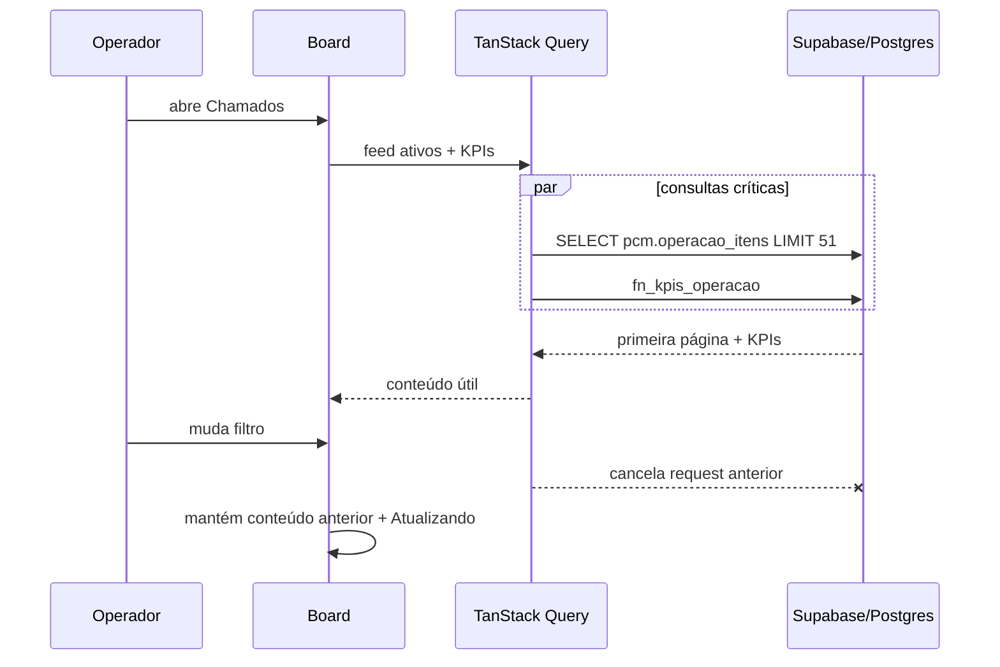

# Technical Design Doc — Fluidez e performance de Chamados

> **Tier:** arquitetural · **Status:** aprovado
> **Autor:** @architect · **Revisor:** @qa · **Data:** 2026-08-10

## Contexto da funcionalidade
`OrdensServicoPage` combina `pcm.ordens_servico` e Chamados abertos no browser. O adapter pagina
internamente de 1000 em 1000 até reunir tudo, busca clientes/funcionários separadamente e traz
campos de detalhe para cada card. E01-S44 empurrou filtros e KPIs ao servidor, mas declarou
paginação de UI e busca server-side fora de escopo. E01-S145 fecha esses gaps. Ver `product.md`.

## Goals / Non-goals

**Goals**
- Read model mínimo, paginado, cancelável e protegido por RLS.
- Cache/deduplicação padronizados com TanStack Query.
- Consultas limitadas e específicas por Lista, Kanban, Timeline, Calendário e Backlog.
- Mutação otimista e alteração em lote com um round-trip.

**Non-goals**
- Rotas/code splitting (E00-S21), domínio novo, virtualização ou mudança de comandos de criação.

## Design proposto

### Leitura
Migration `0178_E01-S145_operacao_read_model_paginado.sql` cria:

1. View `pcm.operacao_itens WITH (security_invoker=on)`, união normalizada de OS não deletadas e
   Chamados abertos ainda sem OS. A view expõe resumo: ids, origem do item, número, título,
   cliente, status, prioridade/GUTD, técnico, agenda, Auvo, erro de sync, tipo OS e orientação.
   Descrição, observação, JSON Auvo, histórico e anotações ficam fora.
2. `pcm.fn_kpis_operacao(...)`, `security invoker`, agregando a view. Recebe busca/cliente/técnico/
   categoria/data; não recebe status.
3. `pcm.fn_operacao_alterar_status_lote(uuid[], text)`, `security invoker`, com subtransação por id
   e retorno `{id,sucesso,erro}`; `updated_by` vem de `auth.uid()`.
4. Índices parciais alinhados ao feed por status/data, cliente/data, agenda e Chamados abertos.

O client consulta a view por keyset. Cursores discriminados:

```ts
type CursorOperacao =
  | { ordem: "recentes"; createdAt: string; id: string }
  | { ordem: "gutd"; score: number; createdAt: string; id: string }
  | { ordem: "agenda"; dataAgendada: string; id: string };
```

Limites: Lista 50; Kanban 30 por coluna; Backlog 50; Timeline/Calendário 200 por intervalo.
Lista começa com pseudostatus `ativos` (`status NOT IN ('finalizado','cancelado')`). Busca usa
`numero/titulo/cliente_nome`, debounce de 250 ms e `AbortSignal` do TanStack Query.

### Aplicação e cache
Novo `OperacaoGateway` separa leitura do command side existente. `PaginaOperacao` retorna itens,
cursor e `total`. TanStack Query usa:

- feed: `staleTime=30s`, `gcTime=5min`, refetch em foco mantendo dados anteriores;
- detalhe: `staleTime=2min`;
- catálogos: `staleTime=10min`, habilitado somente ao abrir/prefetch do modal;
- query keys com visão + filtros + status/intervalo; mutações invalidam apenas chaves afetadas.

`OrdensServicoPage` deixa de chamar `carregar()` global. Cada visão possui query própria. Lista e
Backlog usam `useInfiniteQuery`; Kanban usa uma query infinita por coluna visível; Timeline e
Calendário usam intervalo atual. O detalhe usa resumo imediatamente e busca campos pesados/histórico
quando expandido. Calendário cria um `Map<dia,itens>` uma vez por resposta.

### Sequência


## Cobertura dos 5 eixos

### 1. Tech stack
Adiciona `@tanstack/react-query` ao app web. Supabase/PostgREST atuais já suportam
`.abortSignal(signal)`; PostgreSQL 17 já suporta view `security_invoker`.

### 2. Arquitetura base
CQRS leve: `OperacaoGateway` é read model do board; gateways atuais continuam donos dos comandos.
Sem bounded context ou agregado novo. Decisão registrada no ADR-0021.

### 3. Infra
Migration aditiva, sem drop. Deploy: migration primeiro, frontend depois. Rollback: redeploy do
frontend anterior; view/funções novas podem permanecer sem consumidor.

### 4. Qualidade
pgTAP cobre RLS, união, deduplicação, filtros e lote. Vitest cobre cursores, mapping, cancelamento,
cache e optimistic rollback. Playwright cobre fluxo real e quantidade de requests. Budgets seguem
`performance/README.md`.

### 5. Observabilidade
Marcas `chamados:navigation-start`, `chamados:data-ready` e `chamados:content-painted`, além de
medida `chamados:click-to-content`. Sem envio externo nesta story.

## Mapa de dependências
| Dependência | Tipo | Uso |
|---|---|---|
| PostgreSQL/Supabase | DB/API | view, RPCs, filtros e keyset |
| `@tanstack/react-query` | frontend | cache, cancelamento, infinite query e invalidação |
| E01-S44 | story anterior | KPIs/filtros server-side, parcialmente supersedida |
| E00-S21 | story relacionada | dona de rotas e code splitting; não bloqueia E01-S145 |

## Alternativas consideradas
| Alternativa | Prós | Contras | Decisão |
|---|---|---|---|
| View paginada + TanStack Query | Contrato explícito, RLS, cache padrão | Nova dependência/read model | Escolhida |
| RPC JSON única | Um request | Contrato opaco e ordenações condicionais complexas | Rejeitada |
| Hook/cache próprio | Sem dependência | Reinventa cancelamento, cache e invalidação | Rejeitada |
| Virtualização mantendo full-fetch | DOM menor | Rede e memória continuam crescendo | Rejeitada |

## Trade-offs e consequências
Mais queries no Kanban (uma por coluna), porém pequenas, independentes e cacheadas. Feed deixa de
ser um array completo compartilhado; ações precisam invalidar queries por status. Ganha escala,
cancelamento e menor payload.

## Riscos
| Risco | Prob. × Impacto | Mitigação |
|---|---|---|
| Cursor perde item em timestamps iguais | médio × alto | desempate obrigatório por `id` + teste pgTAP/Vitest |
| View contorna RLS | baixa × alto | `security_invoker`, pgTAP com usuário sem PCM |
| Drag move item entre caches | médio × médio | optimistic update nas duas colunas + invalidação final |
| Busca por `ILIKE` degrada | baixa × médio | budget `EXPLAIN`; volume atual ~2,6 mil; desvio exige ADR/spec |

## Roadmap da feature
| Onda | Entrega | Depende de |
|---|---|---|
| 1 | baseline, migration, ADR e pgTAP | — |
| 2 | gateway/adapter paginado | 1 |
| 3 | TanStack Query e UI | 2 |
| 4 | comandos, qualidade e rollout | 3 |

## Questões em aberto
- Nenhuma.
