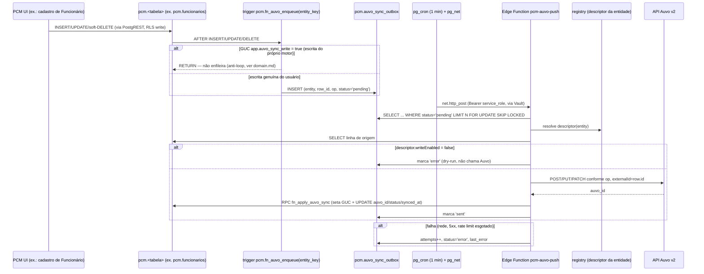

# Technical Design Doc — Motor de sync PCM↔Auvo

> **Tier:** arquitetural · **Status:** aprovado
> **Autor:** Claude (sessão Lucas) · **Revisores:** Lucas (PO) · **Data:** 2026-07-07
> Responde: **como** no nível de sistema. Cobre a fundação reutilizada por `E01-S23` (read path)
> e por toda story de entidade (`E01-S24`+). Link: `./product.md`, `./domain.md`.

## Contexto da funcionalidade
A fundação Auvo (`E01-S09`/`S10`/`S11`/`S13`) já cobre 2 entidades (Cliente, Task de OS) com
disparo direto: trigger Postgres → `pg_net` → Edge Function → chamada Auvo síncrona, sem retry
nem fila. Escalar isso para ~10 entidades novas (Funcionários, Ferramentas, Serviços,
Equipamentos, Categorias, Equipes, Segmentos, Tipos de Tarefa, Tickets, Clientes-CRUD — ver plano
da épica) do mesmo jeito significaria 10 Edge Functions de disparo quase idênticas, sem retry, sem
budget de rate limit (Auvo permite só 400 req/min). Este design troca isso por **um motor
genérico**: outbox transacional + drain no sentido PCM→Auvo (este story, `E01-S22`), e um
dispatcher de webhook + poller genérico no sentido Auvo→PCM (`E01-S23`). Os dois lados
compartilham o **entity registry** (único lugar do field-map por entidade).

## Goals / Non-goals
**Goals**
- Um outbox (`pcm.auvo_sync_outbox`) + uma função de drain (`pcm-auvo-push`) que qualquer tabela
  PCM registrada usa para propagar create/update/delete ao Auvo, com retry/backoff e sem bloquear
  a transação de origem.
- Um **entity registry** (`supabase/functions/_shared/auvo/registry/`) — único lugar onde o
  mapeamento de campos PCM↔Auvo de cada entidade vive, consumido tanto pelo push (S22) quanto
  pelo dispatcher/poller (S23).
- Idempotência por `externalId = row.id` (reaproveita ADR-0001) em toda chamada Auvo do motor.
- Anti-loop: um upsert inbound (webhook/poller, `S23`) nunca deve reenfileirar um push outbound.
  **Decisão de implementação (substitui a ideia inicial de "sentinela `updated_by`"):** a coluna
  `updated_by` tem `references auth.users` (`0001_E00-S00_schemas_dominio.sql`) — usar um valor
  reservado ali exigiria inserir uma linha falsa em `auth.users` (tabela gerenciada pelo Supabase
  Auth, frágil entre versões). Em vez disso, o motor usa um **GUC transacional**
  (`app.auvo_sync_write`) setado por uma RPC `security definer` (`pcm.fn_apply_auvo_sync`) que
  aplica o patch de sincronização e marca `set_config(..., true)` (local à transação) antes do
  `UPDATE` — o trigger `fn_auvo_enqueue` verifica esse GUC e pula o enqueue. Não exige coluna nova
  em nenhuma tabela sincronizada, nem linha fake em `auth.users`.
- `auvoPatch`/`auvoDelete` no cliente HTTP compartilhado (hoje só tem GET/POST/PUT).

**Non-goals** (deste story, `E01-S22`)
- Descriptors concretos de entidade (Funcionários, Ferramentas, ...) — cada um entra na sua
  própria story (`E01-S24`+), só consumindo a interface `AuvoEntityDescriptor` criada aqui.
- Dispatcher de webhook genérico e poller (`pcm-auvo-pull`) — é `E01-S23`, mesmo design.
- Hard-delete real no Auvo (`DELETE /...`) — decisão do usuário: delete no PCM = soft-delete →
  `PATCH .../{id}` com `active:false` no Auvo. `auvoDelete` é implementado no cliente HTTP por
  completude de contrato, mas nenhum descriptor desta leva o usa (fica reservado para um fluxo
  futuro de hard-delete atrás de superadmin + confirmação, fora de escopo aqui).

## Design proposto

### Visão geral do fluxo (write path — este story)


### Componentes
1. **`supabase/functions/_shared/auvo/client.ts`** (estende o existente) — adiciona `auvoPatch`
   e `auvoDelete`, mesma assinatura/retry 401/429 de `auvoGet/auvoPost/auvoPut`.
2. **`supabase/migrations/0024_E01-S22_auvo_sync_outbox.sql`** — tabela `pcm.auvo_sync_outbox` +
   função `pcm.fn_auvo_enqueue()` (trigger genérica, `TG_ARGV[0]` = chave da entidade, checa o GUC
   `app.auvo_sync_write`) + `pcm.fn_apply_auvo_sync(p_table, p_row_id, p_patch)` (RPC `security
   definer` que seta o GUC e aplica o patch — ver `domain.md`).
3. **`supabase/functions/_shared/auvo/registry/types.ts`** — interface `AuvoEntityDescriptor`.
   **`.../registry/index.ts`** — `Record<string, AuvoEntityDescriptor>` vazio nesta story (só o
   scaffold; primeira entidade real entra em `E01-S24`) + helpers `getDescriptor(entity)`.
4. **`supabase/functions/pcm-auvo-push/index.ts`** — nova Edge Function. Chamada só por
   `service_role` (`requireServiceRole`, mesmo padrão de `pcm-auvo-create-task`). Reivindica um
   lote `pending` do outbox (`FOR UPDATE SKIP LOCKED` — evita corrida se o cron disparar 2x
   simultaneamente), processa cada linha via o descriptor resolvido, nunca lança para o chamador
   (mesmo padrão try/catch-por-linha de `pcm-auvo-customers-import`).
5. **`pg_cron` + `pg_net`** (nova migration) — job `pcm_auvo_push_drain`, `'* * * * *'` (1 min),
   reusa os secrets do Vault já criados em `0011`/`0013`
   (`auvo_trigger_project_url`/`auvo_trigger_service_role_key`) — nenhum secret novo.

### Contrato da tabela outbox
| Coluna | Tipo | Notas |
|---|---|---|
| `id` | uuid PK | `gen_random_uuid()` |
| `entity` | text | chave do registry, ex. `'funcionarios'` |
| `row_id` | uuid | FK lógica (não física — tabelas variam) para a linha de origem |
| `op` | text | `'create'` \| `'update'` \| `'delete'`, `CHECK` |
| `status` | text | `'pending'` \| `'sent'` \| `'error'`, `CHECK`, default `'pending'` |
| `attempts` | int | default 0 |
| `last_error` | text | null até a 1ª falha |
| `enqueued_at` | timestamptz | default `now()` |
| `sent_at` | timestamptz | null até `status='sent'` |

RLS FORCE; só `service_role` tem GRANT (nenhuma policy para `authenticated` — a tabela não é lida
pela UI, é infraestrutura pura). Índice em `(status, enqueued_at)` para o `FOR UPDATE SKIP LOCKED`.

## Cobertura dos 5 eixos

### 1. Tech stack
Nenhuma lib nova. Mesmo runtime Deno + `fetch` nativo do cliente Auvo já existente.

### 2. Arquitetura base
Vive inteiramente em `supabase/` (schema `pcm` + Edge Functions Deno) — não introduz camada nova
em `apps/web/src/features/pcm/`. O **registry** é a Anti-Corruption Layer (mesmo conceito de
`domain.md` de `E01-S09`, generalizado de 1 entidade para N): cada descriptor traduz PCM↔Auvo sem
vazar tipo Auvo para o domínio da feature. UI/`application`/`domain` do PCM não sabem que o outbox
existe — só escrevem na tabela normalmente via RLS; a propagação é 100% infraestrutura.

### 3. Infra
- Nenhum secret novo — reusa `auvo_trigger_project_url`/`auvo_trigger_service_role_key` (Vault) já
  provisionados em `0011`.
- `pg_cron`/`pg_net` já habilitados no projeto (usados por `0011`/`0013`/`0015`).
- Reversão: desabilitar o job (`select cron.unschedule('pcm_auvo_push_drain')`) para parar a
  do outbox sem reverter deploy — a fila só cresce, não perde dado.

### 4. Qualidade
- Unidade (Deno): `client.ts` — `auvoPatch`/`auvoDelete` seguem o mesmo contrato testável de
  `auvoGet`/`auvoPost`/`auvoPut` (mock de `fetch`). Registry — `getDescriptor` retorna
  `undefined` para chave desconhecida (não lança).
- Integração: `pcm-auvo-push` contra um mock HTTP do Auvo — cenário idempotência (mesma linha
  processada 2x ⇒ 1 create + 1 PUT/PATCH subsequente, nunca 2 creates), cenário retry (falha
  simulada ⇒ `attempts++`, `status='error'`, não trava as próximas linhas do lote), cenário
  `writeEnabled:false` (nunca chama `fetch` do Auvo).
- pgTAP: `force row level security` na outbox, sem policy para `authenticated` (nem SELECT),
  `fn_auvo_enqueue` não enfileira quando o GUC `app.auvo_sync_write` está `true` (setado via
  `fn_apply_auvo_sync`), e enfileira normalmente numa escrita direta sem o GUC.
- Aceite: um teste por AC de `spec.md`.

### 5. Observabilidade
Mesmo padrão de log estruturado JSON de `pcm-auvo-create-task`/`client.ts` (`ts`, `nivel`, `fn`,
`reqId`) em cada linha processada pelo drain — inclui `entity`, `row_id`, `op`, resultado. Falha
grava `last_error` na própria linha do outbox (truncado, sem vazar stack) — é o dado que serve de
"fila de reconciliação manual" enquanto não há alerta automático (fase futura).

## Mapa de dependências
| Dependência | Tipo | Descrição | Métodos / endpoints |
|---|---|---|---|
| API Auvo v2 | REST (Bearer JWT) | Escrita das entidades sincronizadas | `POST`/`PUT`/`PATCH /<recurso>` |
| Supabase Vault | Secrets | Reusa `auvo_trigger_project_url`/`...service_role_key` de `0011` | — |
| `pg_cron`/`pg_net` (extensões) | Trigger assíncrono | Drena o outbox a cada 1 min | — |

## Alternativas consideradas
| Alternativa | Prós | Contras | Por que (não) escolhida |
|---|---|---|---|
| Outbox + drain cron (escolhida) | Retry/backoff nativo; budget de rate-limit controlável (lote por minuto); ordena e serializa por entidade | +1 tabela, +1 Edge Function | É o único jeito de dar retry e não estourar 400 req/min quando 10 entidades escreverem ao mesmo tempo |
| Trigger `pg_net` direto por tabela (padrão atual de `0011`) | Reusa exatamente o padrão já existente, zero tabela nova | Sem retry — falha vira `failed` permanente até reprocesso manual; sem controle de rajada | Já é a dívida conhecida dos 2 fluxos existentes; não escala para 10 entidades sem reintroduzir o mesmo problema 10x |
| Fila real (ex. pgmq, serviço externo) | Mais robusto para volume alto | Infra nova, fora do padrão do projeto (só Supabase-nativo até aqui) | Volume da Sinérgica é baixo (uma empresa, não SaaS multi-tenant) — outbox+cron simples já resolve, sem introduzir dependência nova |

## Trade-offs e consequências
- Aceitamos latência de até 1 min entre a escrita no PCM e a chegada no Auvo (drain por minuto,
  não em tempo real) — aceitável para cadastro (não é operação crítica de campo).
- Ganhamos: um único motor testável, ao invés de 10 disparos artesanais; retry automático; budget
  de rate-limit controlável por tamanho de lote.
- Dívida assumida conscientemente: sem alerta automático quando uma linha fica `status='error'`
  por muitos `attempts` — reconciliação é manual (consulta à tabela) nesta fase, igual ao padrão
  já aceito em `E01-S09`.

## Riscos
| Risco | Descrição | Prob. × Impacto | Ações / mitigações |
|---|---|---|---|
| Campo/formato não verificado contra Auvo real | `client.ts` já registra que nomes de campo/`paramFilter` não foram confirmados em produção | alta × médio | Todo descriptor nasce com `writeEnabled:false`; liga-se só após uma chamada real de verificação (task própria em cada story de entidade) |
| Rate limit (400/min) estourado quando vários pollers/outbox rodarem juntos | Ainda não há orçamento formal por entidade | média × médio | `E01-S23` deve definir tabela de cadência por entidade antes de ligar todos os pollers; drain do outbox processa em lote pequeno (a definir em tasks.md) |
| Corrida entre 2 disparos do cron (lote sobreposto) | `pg_cron` pode invocar antes do lote anterior terminar | baixa × médio | `FOR UPDATE SKIP LOCKED` na reivindicação do lote — 2 execuções concorrentes nunca pegam a mesma linha |
| Anti-loop mal aplicado | Se um write inbound (S23) escrever direto na tabela em vez de passar por `fn_apply_auvo_sync`, gera loop write→Auvo→webhook→write→... | baixa × alto | Testado explicitamente no pgTAP/integração desta story; `E01-S23` deve usar a mesma RPC para todo upsert inbound, reforçado por code review |
| **[RESOLVIDO em `E01-S22`, achado ao mapear o catálogo para `E01-S24`+]** PATCH da Auvo v2 é JSON Patch (`[{op:"replace",path,value}]`), não objeto flat | Confirmado em múltiplos recursos do blueprint público (Task Types, Services, Equipments, Products, Tickets) — todos os exemplos de `PATCH` usam esse formato, nunca um objeto parcial simples. `pcm-auvo-push` inicialmente enviava o objeto flat de `descriptor.toAuvo()` direto — quebraria todo `PATCH` real assim que o primeiro descriptor ligasse `writeEnabled:true` | alta × alto (silencioso até o 1º PATCH real) | Adicionado `_shared/auvo/json-patch.ts` (`toAuvoJsonPatch`), `pcm-auvo-push` agora converte antes de toda chamada `auvoPatch`. Ainda **NÃO VERIFICADO** contra uma chamada real (formato exato do `path` — com ou sem barra inicial — segue o exemplo da doc, não uma resposta confirmada) |

## Roadmap da feature
| Fase / onda | Entrega | Quando | Depende de |
|---|---|---|---|
| 1 (`E01-S22`, este story) | `auvoPatch`/`auvoDelete`, outbox, `fn_auvo_enqueue`, `pcm-auvo-push`, scaffold do registry | Próxima sessão de dev | — |
| 2 (`E01-S23`) | Dispatcher de webhook genérico + `pcm-auvo-pull` (poller) + auto-registro de webhook Auvo | Depois de 1 | Fase 1 (registry compartilhado) |
| 3 (`E01-S24`+) | Um descriptor + migration + CRUD de UI por entidade (Tipos de Tarefa, Segmentos, Funcionários, ...) | Depois de 2 | Fases 1 e 2 |

## Questões em aberto
- [x] Tamanho do lote do drain (`LIMIT N` no `pcm-auvo-push`) — 20/execução (1200/hora, bem abaixo
      de 400/min), implementado em `E01-S22`.
- [x] Cadência de cron por entidade e algoritmo do dispatcher — resolvidos abaixo (adendo `E01-S23`).

## Adendo — Read path (`E01-S23`)

Escrito ao abrir `E01-S23`, antes de codar (evita repetir um `design.md` novo para a segunda
metade do mesmo motor — mesma decisão de reuso já usada em `E01-S10`/`E01-S11` sobre o design de
`E01-S09`). Cobre os dois mecanismos de entrada Auvo→PCM que faltavam no adendo original.

### Dispatcher de webhook genérico
Generaliza [`pcm-auvo-webhook/index.ts`](../../supabase/functions/pcm-auvo-webhook/index.ts)
(hoje só processa `entity=Task`, ignora todo o resto) sem tocar no handler de Task existente:

```mermaid
sequenceDiagram
    participant AUVO as API Auvo v2
    participant WH as Edge Function pcm-auvo-webhook
    participant REG as registry (por webhookEntity)
    participant DB as pcm.<tabela>

    AUVO->>WH: POST (HMAC X-Auvo-Signature)
    WH->>WH: valida assinatura (verify-signature.ts, já existe)
    alt entity == Task (4)
        WH->>DB: handler de status de OS (já existe, inalterado)
    else entity em {User, Customer, Equipment, Ticket}
        WH->>REG: byWebhookEntity(entity)
        alt descriptor não encontrado ou writeEnabled=false
            WH-->>AUVO: 200 { ignored: true } (nunca 4xx/5xx — Auvo reentregaria para sempre)
        else
            WH->>DB: RPC fn_apply_auvo_sync(pcmTable, ..., descriptor.fromAuvo(payload))
            Note over DB: upsert por auvo_id; action=3 (Exclusão) → patch { deleted_at: now(), ativo: false }
        end
    end
    WH-->>AUVO: 200 { ok: true }
```

Implementação: um `switch (evento.entity)` novo antes do `if (evento.entity !== AUVO_ENTITY_TASK)`
atual — quando bate uma das 4 entidades extras, resolve o descriptor por
`byWebhookEntity(entity)` (novo helper em `registry/index.ts`, filtra por
`descriptor.webhookEntity === entity`) e faz upsert por `auvo_id` via `fn_apply_auvo_sync` (mesma
RPC do write path — reforça o anti-loop: o dispatcher NUNCA faz `UPDATE`/`INSERT` direto na
tabela, sempre pela RPC). Ação de exclusão (`action=3`) vira patch `{ deleted_at: now() }` (soft-
delete, mesmo padrão de todo o projeto) em vez de `DELETE` físico.

### Poller genérico (`pcm-auvo-pull`)
Generaliza o padrão já usado em
[`pcm-auvo-customers-import`](../../supabase/functions/pcm-auvo-customers-import/index.ts) (pagina
→ upsert por `auvo_id` → soft-delete guardado por resultado vazio) para qualquer descriptor com
`cronSchedule` definido: `pcm-auvo-pull` recebe `{ entity }` no corpo (uma invocação por
entidade — cron dispara N vezes, uma por descriptor, nunca uma função "faz tudo"), pagina via
`auvoPaginate`, mapeia cada registro com `descriptor.fromAuvo`, upsert em lote via `fn_apply_auvo_sync`
por linha (ou um `upsert` direto por `auvo_id` quando o volume justificar — decisão de
implementação de `E01-S23`, não deste design), e aplica a mesma guarda de soft-delete em massa
(resultado vazio ⇒ pula reconciliação, loga aviso).

### Orçamento de rate-limit (400 req/min) — cadência por tipo de entidade
| Cadência | Quando usar | Exemplo |
|---|---|---|
| Webhook (tempo real, sem polling) | Entidade tem `webhookEntity` | Funcionários, Clientes, Equipamentos, Tickets |
| Diária (`0 6 * * *`, mesmo horário de `0013`/`0015`) | Catálogo estático, muda raramente | Tipos de Tarefa, Segmentos, Palavras-chave, Categorias, Grupos de Clientes |
| A cada 6h | Catálogo que muda com alguma frequência mas não é webhook-capable | Serviços, Ferramentas/Produtos, Equipes |

Cada cron chama `pcm-auvo-pull` para UMA entidade (nunca todas de uma vez), então mesmo com 6-8
descriptors na cadência diária/6h, o total fica ordens de magnitude abaixo de 400 req/min — o
outbox drain (1/min, lote de 20) segue sendo o maior consumidor previsível do budget.

### Auto-registro de webhook
Nova Edge Function one-shot `pcm-auvo-webhooks-register` (invocação manual pós-deploy, não cron):
itera os descriptors com `webhookEntity` definido, chama `POST /webhooks` (idempotente pelo `id`
— Auvo atualiza em vez de duplicar se um `id` existente for reenviado) com
`targetUrl = <project_url>/functions/v1/pcm-auvo-webhook` e guarda o `id` retornado (log
estruturado; não há tabela de controle nesta fase — reexecutar a função é seguro por ser
idempotente do lado do Auvo).

> Decisão difícil de reverter tomada aqui (outbox como mecanismo único de propagação PCM→Auvo,
> substituindo o padrão de trigger direto para toda entidade nova) → registrar como
> **ADR-0005** (`docs/adr/0005-outbox-sync-auvo.md`) antes de implementar a task 2 (migration).
