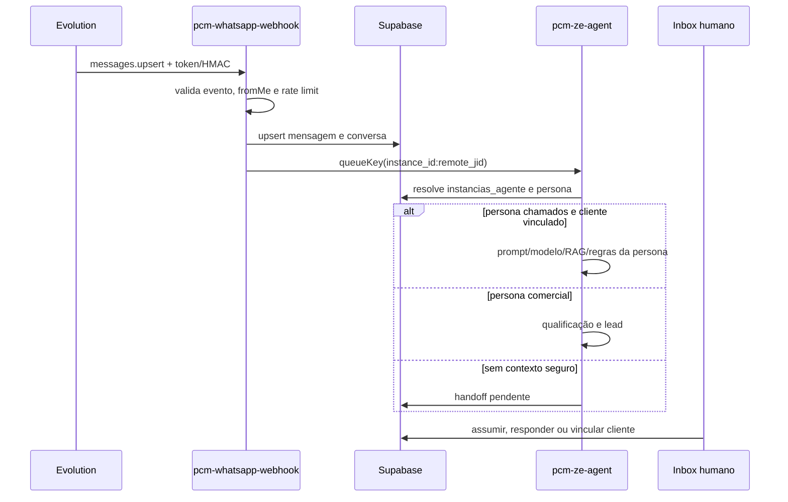

# Technical Design Doc — Atendimento Evolution multi-instância operacional

> **Tier:** arquitetural · **Status:** aprovado
> **Autor:** @architect · **Revisores:** @security, @qa · **Data:** 2026-07-22

## Contexto da funcionalidade
Complementa E02-S01, S06, S08, S14, S15, S19 e S21. Hoje `config_ze.group_jid` decide o fluxo de
chamados antes de `instancias_agente`, fazendo toda instância de chamados usar a primeira persona
ativa do tipo. Ver [product.md](./product.md).

## Goals / Non-goals
**Goals**
- Resolver persona pelo `instance_id` antes de processar a mensagem.
- Preservar fallback legado para condomínios ainda sem vínculo de instância.
- Tornar handoff e vínculo CRM transacionais e auditáveis.
- Aderir ao contrato Evolution configurado no mesmo servidor.

**Non-goals**
- Multi-servidor Evolution, balanceamento entre provedores ou agente genérico sem tipo de negócio.

## Design proposto

Prioridade de roteamento:
1. `atendimento.instancias_agente.instance_id` ativo.
2. Fallback legado: conversa com `config_ze` usa persona ativa `tipo='chamados'`.
3. Sem persona: fila termina `skipped`, sem chamada LLM.

Persona `chamados` exige `client_id` resolvido pela conversa/configuração. Persona `comercial` cria
lead. Prompt, `modelo_llm`, RAG, janela e regras vêm da persona resolvida.

Handoff automático grava `modo='pausado'`, `status='pendente'`, motivo e evento append-only. Gatilhos:
palavra, número de respostas, limite diário ou falta de cliente para agente de chamados. Assumir e
enviar manualmente mantêm pausa; devolver limpa atribuição e retorna para `auto`.

Vínculo CRM usa RPC atômica: atualiza `conversas.client_id`, cria `relacionamento.vinculos` do
contato para `pcm_cliente` e registra evento append-only.

## Cobertura dos 5 eixos

### 1. Tech stack
Sem serviço novo: React/Vitest, Supabase/Postgres/pgTAP, Edge Functions Deno e Evolution API.

### 2. Arquitetura base
`atendimento` continua dono da conversa e roteamento; `relacionamento` mantém identidade transversal;
`pcm` continua dono do cliente. Decisão registrada em ADR-0013.

### 3. Infra
Migration aditiva `0146`; mesmas credenciais globais Evolution. Novo segredo opcional
`EVOLUTION_WEBHOOK_TOKEN`, usado como header por instância quando HMAC nativo não estiver disponível.
Rollback desativa funções/policies/colunas novas sem apagar mensagens.

### 4. Qualidade
Unidade para roteamento/contrato/regras, pgTAP para vínculo/auditoria/RLS, teste Edge de payload e UAT
com duas instâncias. Budget: webhook responde p95 < 2s antes do processamento assíncrono; agente p95
< 15s. Consultas por `(instance_id, remote_jid)` e `instance_id` indexadas.

### 5. Observabilidade
Logs estruturados incluem `reqId`, `instanceId`, status de roteamento e motivo de handoff, sem texto
integral/PII. Eventos append-only provam handoff e vínculo.

## Mapa de dependências
| Dependência | Tipo | Descrição | Métodos / endpoints |
|---|---|---|---|
| Evolution API | REST/webhook | conexão, webhook e mensagens | `/instance/*`, `/webhook/set/*`, `/message/sendText/*` |
| OpenRouter | REST | extração por persona | `/api/v1/chat/completions` |
| Supabase | Postgres/Edge | fila, RLS e runtime | `atendimento.*`, `relacionamento.*`, `pcm.*` |

## Alternativas consideradas
| Alternativa | Prós | Contras | Decisão |
|---|---|---|---|
| Resolver persona por `instance_id` | isolamento explícito | exige configurar vínculo | escolhida |
| Resolver só por `persona.tipo` | compatibilidade simples | cruza instâncias | rejeitada |
| Credencial Evolution por instância | isolamento máximo | contradiz servidor único | rejeitada |

## Trade-offs e consequências
Fallback legado evita interrupção, mas deve ser removido após todas instâncias serem vinculadas. Token
estático de webhook é aceito somente sobre HTTPS e com comparação constante; HMAC permanece preferido.

## Riscos
| Risco | Prob. × Impacto | Mitigação |
|---|---|---|
| eco `fromMe` | alto × alto | ignorar antes de persistir/enfileirar |
| cruzamento de persona | médio × alto | resolução exata + testes A/B |
| webhook forjado | médio × alto | HMAC/token, rate limit e fail-closed |
| vínculo CRM errado | baixo × alto | seleção explícita + evento auditável |

## Roadmap da feature
| Fase | Entrega | Quando | Depende de |
|---|---|---|---|
| 1 | migration, runtime, UI e testes locais | atual | — |
| 2 | aplicar Supabase e UAT com duas instâncias | após CI | 1 |

## Questões em aberto
Nenhuma. Decisão do usuário: um servidor Evolution, múltiplas instâncias.

